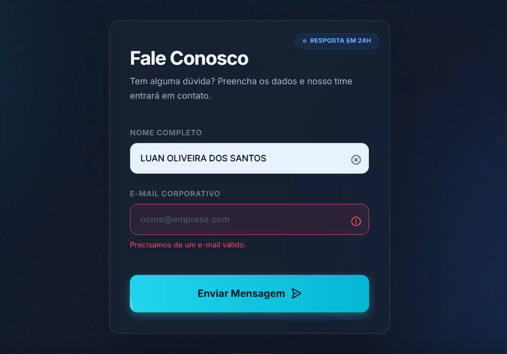

# 🚀 Missão do Dia: Validação Simples de Formulário

Este projeto tem como objetivo implementar uma **validação simples de formulário** na seção de contato, evitando o envio de dados incompletos.

---

## 🎯 Objetivo

Evitar o envio de formulários com **campos obrigatórios vazios**, garantindo uma melhor experiência para o usuário e dados mais consistentes.

---

## 🛠️ Requisitos Técnicos

* Interceptar o evento **submit** do formulário
* Verificar se os campos **nome** e **e-mail** estão preenchidos
* Exibir uma **mensagem de erro visual** caso algum campo obrigatório esteja vazio

---

## 📊 Dificuldade

**Fácil**

---

## 🔗 Entrega

Projeto desenvolvido para o **Portal GoDevs**.

---

## 📌 Observações

Este projeto é ideal para iniciantes que desejam praticar:

* Manipulação de eventos em JavaScript
* Validação básica de formulários
* Feedback visual para o usuário

---

💡 *Sinta-se à vontade para evoluir a validação adicionando novos campos ou regras mais avançadas!*